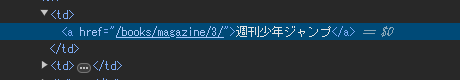

# webscraping

## 各種モジュール

### 限定的な用途で使用可能

newspaper3k

pandas read_html

### 汎用的な用途で使用可能

requests
urlからhtmlの情報を取得する
ログイン処理などがあると、対応できない
パラメータを指定することで、ブラウザの検索まで実行することができる

beautifulsoup
htmlなどの情報を入力として、内部のデータを取得することができる。
おおきく3つの方法があり、
html階層移動
find,find_all
select
がある

selenium


対象のURLページで右クリック->検証で右側に開発ページが出る




```python
driver.find_element(By.XPATH, "//a[@href='/books/magazine/3/']")
```

注意：XPATHの大元を""でくくった場合は、内部''でくくる必要がある。
逆もしかり。


